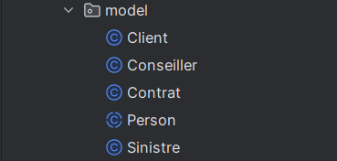
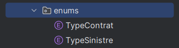
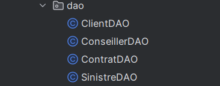
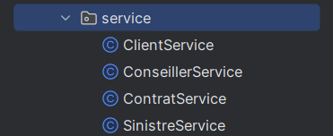
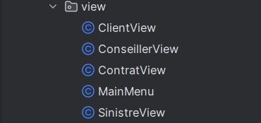
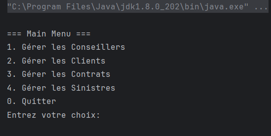
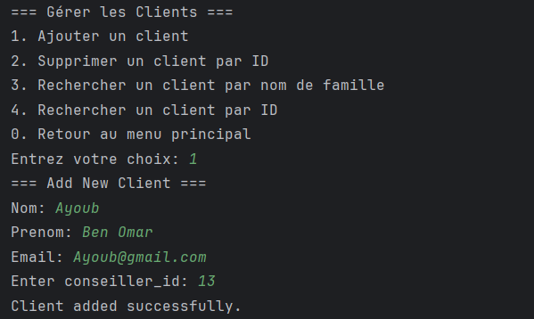
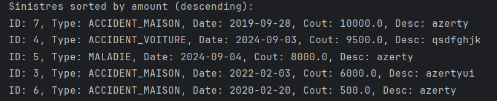

# 🚀 Application de Gestion des Assurances (Java Console App)

## 📌 Contexte du projet
Une société d’assurance souhaite digitaliser ses services.  
Cette application console permet de gérer les assurés (clients), leurs contrats ainsi que les sinistres déclarés.

Elle repose sur une architecture claire (**DAO, Service, Models, Views**) et exploite les concepts modernes de la programmation fonctionnelle en Java (**Streams, Lambda, Optional**).

---

## 🎯 Objectifs du projet
- Créer une application console fonctionnelle pour gérer des assurés et leurs sinistres.
- Introduire et appliquer les concepts de programmation fonctionnelle en Java :
    - **Streams API** pour le traitement de collections
    - **Expressions Lambda** et **Method References** pour simplifier le code
    - **Optional** pour une gestion sécurisée des valeurs nulles
    - **Java Time API** pour les dates
    - **JDBC** pour la persistance des données

---

## 🖥️ Interface utilisateur (Menus)

### 🔹 Gestion des Conseillers
- Ajouter un conseiller (ID généré automatiquement)
- Supprimer un conseiller par son ID
- Rechercher un conseiller par son ID
- Afficher les clients d’un conseiller par son ID

### 🔹 Gestion des Clients
- Ajouter un client (ID généré automatiquement)
- Supprimer un client par son ID
- Rechercher un client par son **nom de famille** (tri alphabétique – Stream API)
- Rechercher un client par son **ID** (avec Optional)
- Afficher la liste des clients d’un conseiller (Stream API)

### 🔹 Gestion des Contrats
- Ajouter un contrat (ID généré automatiquement, rattachement client)
- Afficher un contrat par ID (Optional)
- Supprimer un contrat par ID
- Afficher les contrats d’un client donné (par ID)

### 🔹 Gestion des Sinistres
- Ajouter un sinistre (ID généré automatiquement, rattachement contrat)
- Supprimer un sinistre par son ID
- Calculer le coût total des sinistres d’un client (Stream API)
- Rechercher un sinistre par ID (Optional)
- Afficher les sinistres d’un contrat donné (Stream API)
- Afficher les sinistres triés par montant décroissant (Stream API)
- Afficher les sinistres par ID client (Stream API)
- Afficher les sinistres avant une date donnée (Stream API)
- Afficher les sinistres dont le coût > montant donné (Stream API)

---

## 🏗️ Structure de l’Application

### 📦 Package **model**
Contient les entités principales :
- Person (nom, prénom, email)
- Conseiller (extends Person)
- Client (extends Person, rattachement conseiller)
- Contrat (id, typeContrat, dateDebut, dateFin, client)
- Sinistre (id, typeSinistre, date, coût, description, contrat)

✏️ *Explication : séparé les entités ici.*

---

### 📦 Package **enum**
- TypeContrat : automobile, maison, maladie
- TypeSinistre : accident de voiture, accident de maison, maladie

✏️ *Explication : l’utilisation des enums pour éviter les valeurs en dur.*

---

### 📦 Package **dao**
- ClientDAO
- SinistreDAO
- ContratDAO
- SinistreDAO

➡️ Communication directe avec la base de données (CRUD avec JDBC).

✏️ *Explication : séparé la logique d’accès aux données.*

---

### 📦 Package **service**
- ConseillerService
- ClientService
- ContratService
- SinistreService

➡️ Contient toute la logique métier (filtrage, tri, calculs).

✏️ *Explication : séparer la logique métier du stockage (DAO).*

---

### 📦 Package **view**
- ClientView
- SinistreView
- ContratView
- SinistreView

➡️ Interface utilisateur console (affichage des menus, interaction avec l’utilisateur).

✏️ *Explication : découpler la présentation de la logique métier.*

---

## ⚙️ Spécifications techniques
- **Langage** : Java 8
- **Base de données** : JDBC
- **Concepts utilisés** :
    - Encapsulation (toutes les propriétés privées + getters/setters)
    - Streams API
    - Optional
    - Java Time API
    - Lambdas & Method References

---

## 📸 Captures d’écran
- Exemple de menu principal

- Exemple d’ajout d’un client

  

- Exemple d’affichage des sinistres triés

  

---

## ✅ Conclusion
Ce projet illustre l’utilisation de **Java moderne (Java 8)** avec une architecture en couches claire (**DAO, Service, View, Model**).  
Il met en avant la **séparation des responsabilités** et l’exploitation de l’API **Streams** pour simplifier le code et améliorer la lisibilité.  
